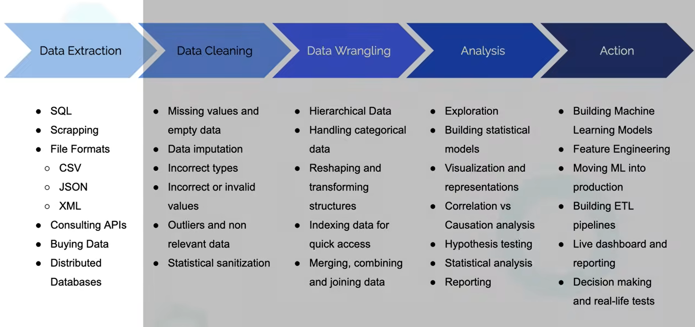
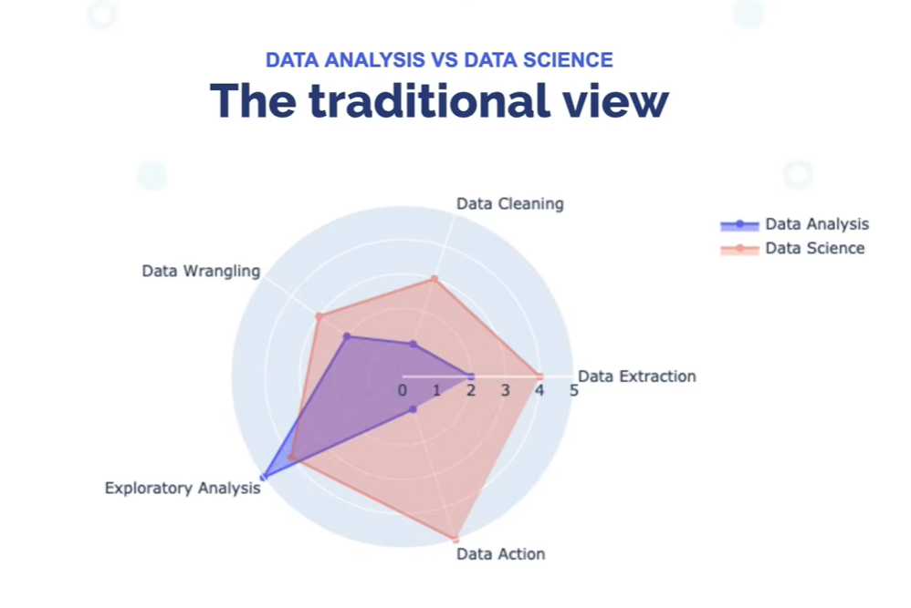
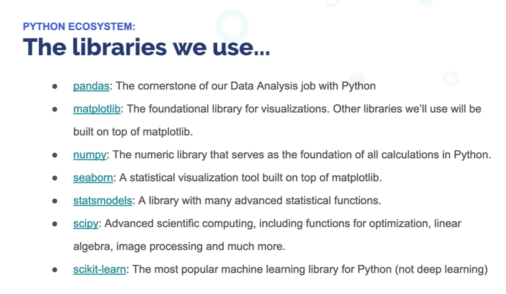

# Data Analysis with Python

**Tools covered:** NumPy, Pandas, Matplotlib, Seaborn

---

## What is Data Analysis?

A process of inspecting, cleansing, transforming, and modeling data with the goal of discovering useful information, informing conclusions, and supporting decision-making.

| Step | Tool |
|---|---|
| Inspecting, cleaning, transforming | Pandas |
| Modeling data | NumPy |
| Visualization | Matplotlib, Seaborn |
| Conclusion | — |

---

## Tools for Data Analysis

**Closed-source / auto-managed tools**
- Qlik, Tableau
- Closed source and limited

**Programming languages**
- Python, R, Julia
- Open source and powerful

---

## Data Analysis Process



## Data Analysis vs. Data Science



## Python & PyData Ecosystem



---

## Intro to NumPy

**NumPy** — Numeric computing library

NumPy (Numerical Python) is one of the core packages for numerical computing in Python. Pandas, Matplotlib, Statsmodels, and many other scientific libraries rely on NumPy.

NumPy's major contributions:
- Fast computation with C primitives
- Efficient collections with vectorized operations
- An integrated and natural Linear Algebra API
- A C API for connecting NumPy with libraries written in C, C++, or FORTRAN

### Everything in Python is an object

Python is a high-level, object-oriented programming language. Python is designed for simplicity — to achieve that simplicity, it wraps all numbers in objects.

### Topics

1. **Array**
   ```python
   a = np.array([1, 2, 3, 4])
   ```

2. **Dimensions and shapes** (matrices)

3. **Indexing & slicing** of matrices

4. **Summary statistics**
   - `mean`, `sum`, `std`, `var`

5. **Broadcasting and vectorized operations**

6. **Boolean arrays**

7. **Linear algebra**
   - Matrix multiplication: `A @ B`
   - Transpose: `B.T`

8. **Useful NumPy functions**

   - `np.random.random(size=2)`
     Generates random numbers from 0 (inclusive) to 1 (exclusive) using a uniform distribution.

   - `np.random.normal(size=2)`
     Generates random numbers from a normal (Gaussian) distribution. Values can be negative, positive, and theoretically any real number.

   - `np.random.rand(2, 4)`
     Generates a 2×4 array (2 rows × 4 columns) of random numbers from 0 to 1, using a uniform distribution.